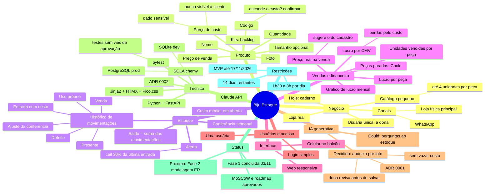

# Visão geral do projeto

```mermaid
mindmap
  root((Biju Estoque))
    Negócio
      Usuária única: a dona
      Loja real
      Canais
        Loja física principal
        WhatsApp
      Catálogo pequeno
        até 4 unidades por peça
      Hoje: caderno
    Produto
      Nome
      Preço de custo
        dado sensível
        nunca visível à cliente
      Preço de venda
      Código
        esconde o custo? confirmar
      Quantidade
      Tamanho opcional
      Foto
      Kits: backlog
    Estoque
      Histórico de movimentações
        Entrada com custo
        Venda
        Presente
        Uso próprio
        Defeito
        Ajuste da conferência
      Saldo = soma das movimentações
      Alerta
        ceil 30% da última entrada
      Conferência semanal
      Custo médio: em aberto
    Vendas e financeiro
      Lucro por CMV
        perdas pelo custo
      Gráfico de lucro mensal
      Lucro por peça
      Unidades vendidas por peça
      Preço real na venda
        sugere o do cadastro
      Peças paradas: Could
    Interface
      Celular no balcão
      Web responsiva
    Usuários e acesso
      Uma usuária
      Login simples
    IA generativa
      Decidido: anúncio por foto
        ADR 0001
        sem vazar custo
        dona revisa antes de salvar
      Could: perguntas ao estoque
    Técnico
      ADR 0002
      Python + FastAPI
      Jinja2 + HTMX + Pico.css
      SQLAlchemy
        SQLite dev
        PostgreSQL prod
      Claude API
      pytest
        testes sem viés de aprovação
    Status
      Fase 1 concluída 03/11
      MoSCoW e roadmap aprovados
      Próxima: Fase 2 modelagem ER
    Restrições
      MVP até 17/11/2026
      14 dias restantes
      1h30 a 3h por dia
```
