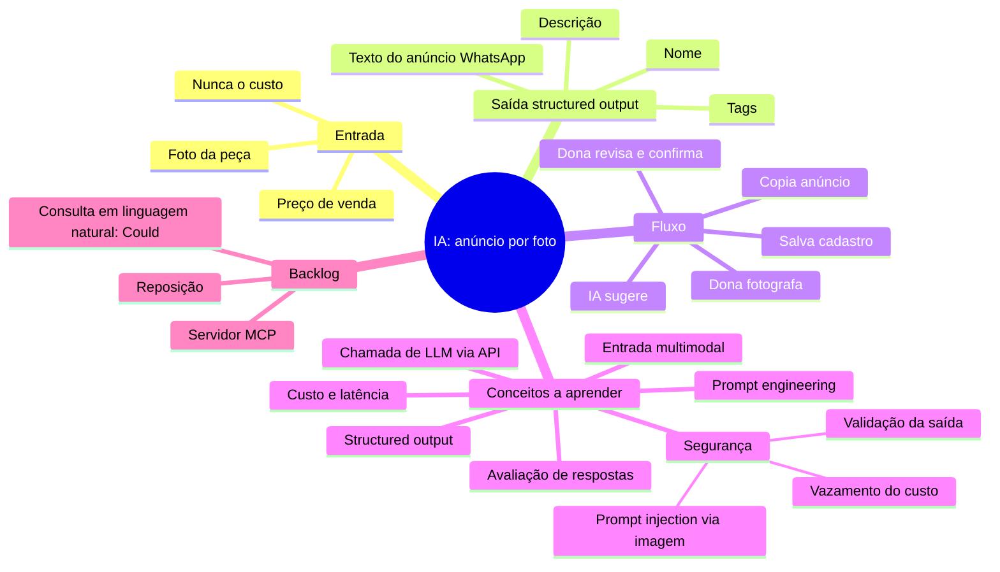
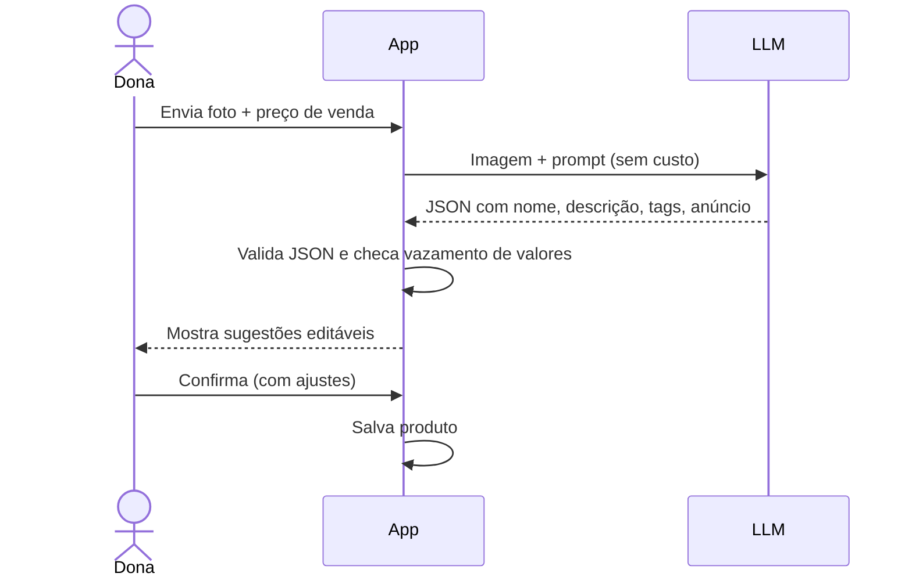

# Mapa: componente de IA

```mermaid
mindmap
  root((IA: anúncio por foto))
    Entrada
      Foto da peça
      Preço de venda
      Nunca o custo
    Saída structured output
      Nome
      Descrição
      Tags
      Texto do anúncio WhatsApp
    Fluxo
      Dona fotografa
      IA sugere
      Dona revisa e confirma
      Salva cadastro
      Copia anúncio
    Conceitos a aprender
      Chamada de LLM via API
      Entrada multimodal
      Structured output
      Prompt engineering
      Avaliação de respostas
      Custo e latência
      Segurança
        Vazamento do custo
        Validação da saída
        Prompt injection via imagem
    Backlog
      Consulta em linguagem natural: Could
      Reposição
      Servidor MCP
```

```mermaid
sequenceDiagram
    actor Dona
    participant App
    participant LLM
    Dona->>App: Envia foto + preço de venda
    App->>LLM: Imagem + prompt (sem custo)
    LLM-->>App: JSON com nome, descrição, tags, anúncio
    App->>App: Valida JSON e checa vazamento de valores
    App-->>Dona: Mostra sugestões editáveis
    Dona->>App: Confirma (com ajustes)
    App->>App: Salva produto
```
