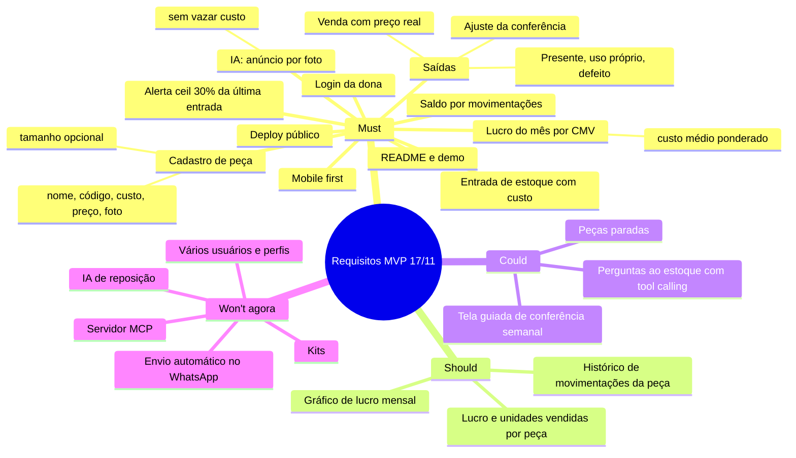

# Mapa: requisitos (MoSCoW), aprovado em 03/11/2026

```mermaid
mindmap
  root((Requisitos MVP 17/11))
    Must
      Login da dona
      Cadastro de peça
        nome, código, custo, preço, foto
        tamanho opcional
      Entrada de estoque com custo
      Saídas
        Venda com preço real
        Presente, uso próprio, defeito
        Ajuste da conferência
      Saldo por movimentações
      Alerta ceil 30% da última entrada
      Lucro do mês por CMV
        custo médio ponderado
      IA: anúncio por foto
        sem vazar custo
      Mobile first
      Deploy público
      README e demo
    Should
      Gráfico de lucro mensal
      Lucro e unidades vendidas por peça
      Histórico de movimentações da peça
    Could
      Peças paradas
      Perguntas ao estoque com tool calling
      Tela guiada de conferência semanal
    Won't agora
      Kits
      Vários usuários e perfis
      IA de reposição
      Servidor MCP
      Envio automático no WhatsApp
```
