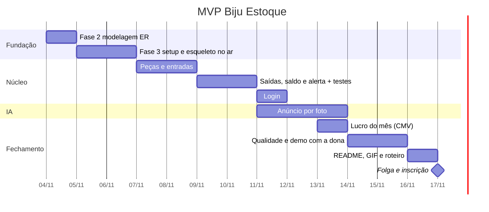

# Roadmap até 17/11/2026, aprovado em 03/11/2026

```mermaid
gantt
    title MVP Biju Estoque
    dateFormat YYYY-MM-DD
    axisFormat %d/%m
    section Fundação
    Fase 2 modelagem ER              :f2, 2026-11-04, 1d
    Fase 3 setup e esqueleto no ar   :f3, 2026-11-05, 2d
    section Núcleo
    Peças e entradas                 :n1, 2026-11-07, 2d
    Saídas, saldo e alerta + testes  :n2, 2026-11-09, 2d
    Login                            :n3, 2026-11-11, 1d
    section IA
    Anúncio por foto                 :ia, 2026-11-11, 3d
    section Fechamento
    Lucro do mês (CMV)               :l1, 2026-11-13, 1d
    Qualidade e demo com a dona      :q1, 2026-11-14, 2d
    README, GIF e roteiro            :p1, 2026-11-16, 1d
    Folga e inscrição                :milestone, 2026-11-17, 0d
```

Princípio: **esqueleto no ar cedo** (deploy na Fase 3), para não descobrir problema de deploy na véspera.
